DICOM Upload and Regististration on a Study Event
===============================================

Task Description
----------------

You want to register DICOM data on a specific study event of a specific subject.

Therefore, you need:

- to select the study subject
- to select the event
- (to upload a DICOM study)
- to register the DICOM study on an upload slot

Prerequisits
------------

- DICOM data available (uploaded to Study0 or as files for the Upload Client)
- Subject is enrolled in your study
- Events and upload slots are defined in the EDC system

Tasks
-----

1. `Preparation`_
2. `Select the Subject`_
3. `Select the Event`_
4. `Assign DICOM Data`_
5. `Upload DICOM Data ("Upload New")`_
6. `Assign Existing DICOM Data`_
7. `Review DICOM Data`_

Preparation
^^^^^^^^^^^

It is important to verify that your Study is active. If you are in a different Study read `here <../overview/overview.rst#change-a-current-active-study>`_ how to change that.

In the menu, navigate to "PACS - medical imaging" -> "Subjects/Events/DICOM".

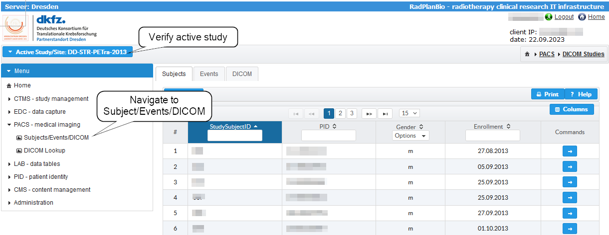

Select the Subject
^^^^^^^^^^^^^^^^^^

First step is to pick the study subject (patient). A click on the table item loads the events for the subject. The notification in the right upper corner shows that.

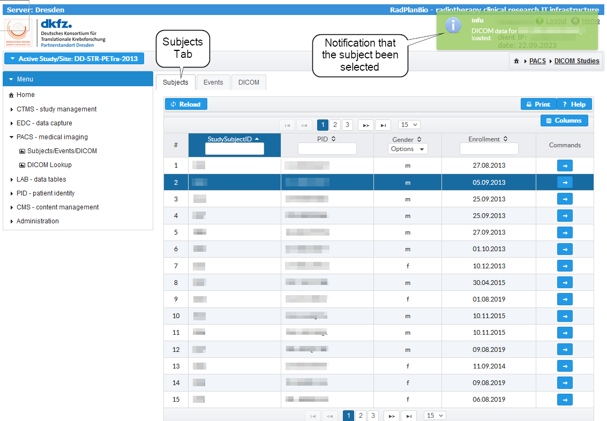

Select the Event
^^^^^^^^^^^^^^^^

Switching to the "Events" tab opens the next view. There you can see available events of the subject. Clicking on the events loads the DICOM data that are already assigned.

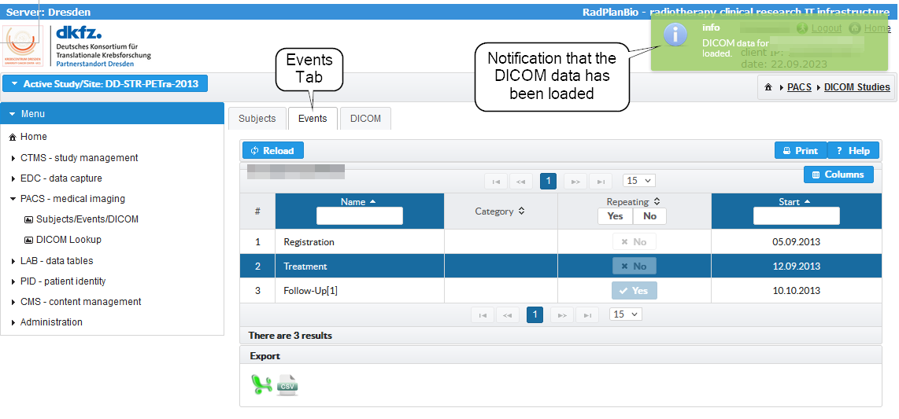

Assign DICOM Data
^^^^^^^^^^^^^^^^^

After loading the DICOM data, you can switch to the DICOM tab. There are two options to register DICOM data depending on your location.

If the location is not fully integrated into the RPB infrastructur [#RPB-Infrastructure]_ , you need to use the option 1 (`Upload DICOM Data ("Upload New")`_) otherwise use the option 2 (`Assign Existing DICOM Data`_).

The table in the tab view would show if there are DICOM studies assigned. We will see that on the end of this section.

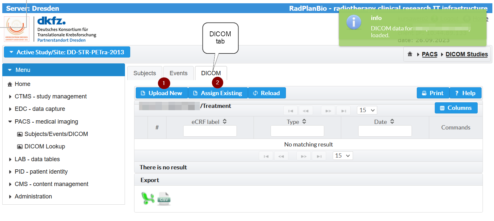

Upload DICOM Data ("Upload New")
^^^^^^^^^^^^^^^^^^^^^^^^^^^^^^^^
This step is necesssary if your location is not fully integrated into the RPB infrastructure otherwise you can skip that step and go to `Assign Existing DICOM Data`_.

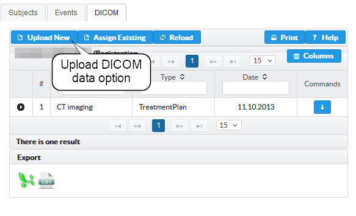

Assign Existing DICOM Data
^^^^^^^^^^^^^^^^^^^^^^^^^^
If you did the step `Upload DICOM Data ("Upload New")`_  then skip this section and go to `Review DICOM Data`_.

In a fully intergrated site, you can just reference the DICOM data by using the "Assign Existing" button. 
An upload from your local computer is not necessary, but `creating project specific DICOM <./study-zero-to-study-specific-task.rst>`_  needs to be done upfront.

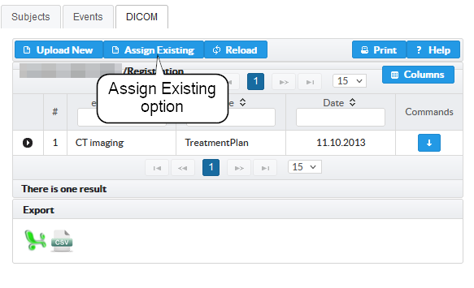

Clicking on the "Assign Existing" button opens a dialog window. In the "DICOM Selection" dialog -

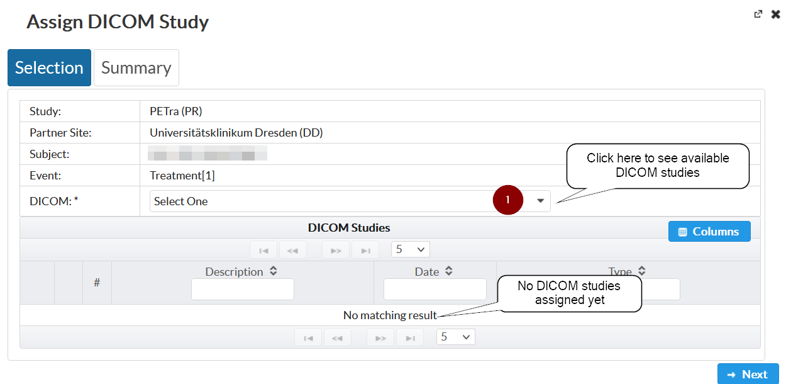

shows a table with available items that belong to the event (Upload slots). In case that the item is already linked with a DICOM study, the "DICOM Study" column would show the title of the assigned DICOM study. 
An empty "DICOM Study" columns means that there is no DICOM data assigned yet. In case that there is something assigned, you could also overwrite and corect that.
 
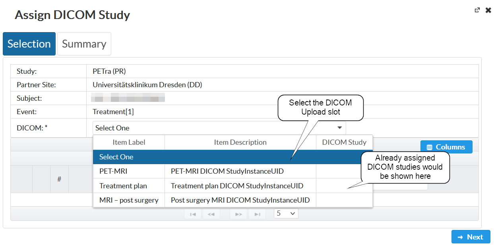

After choosing an Item the portal loads available DICOM studies that are stored in the PACS system (Project Specific Stage). 

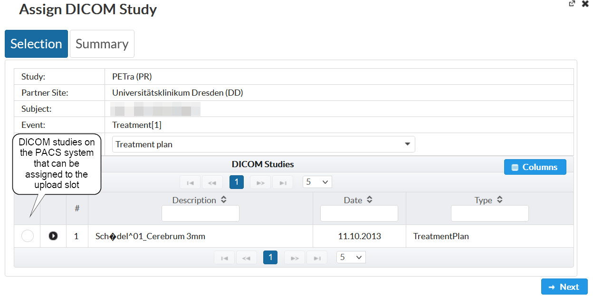

Please choose the DICOM study that you want (1) to assign and click on next (2).

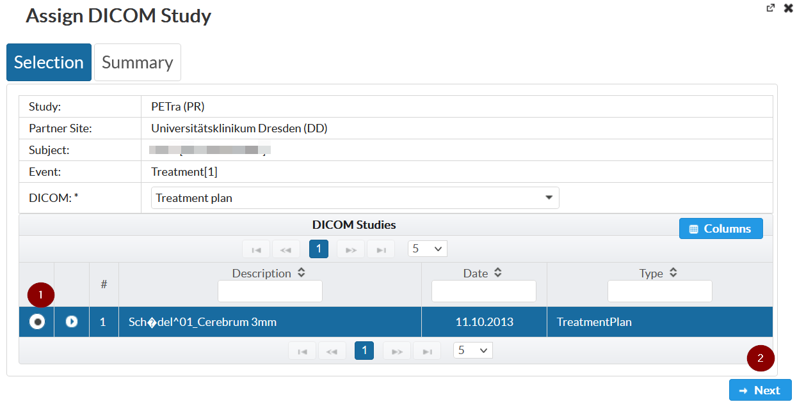

An overview page allows you to verify the data. If everything is correct just click on "Assign DICOM Study" to confirm.

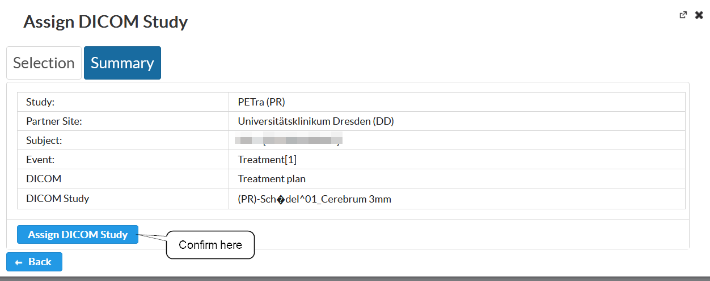

Review DICOM Data
^^^^^^^^^^^^^^^^^
After processing the data, the dialog box will be closed automatically and the DICOM tab shows the table with the new assignment.
Additionally, an info box with the process information pops up.

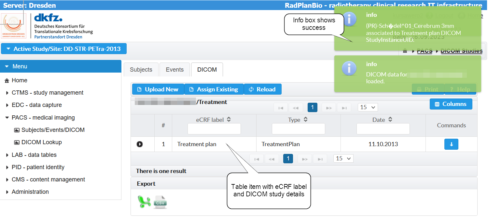

The table item can be extended (1) to review the underlying DICOM series.

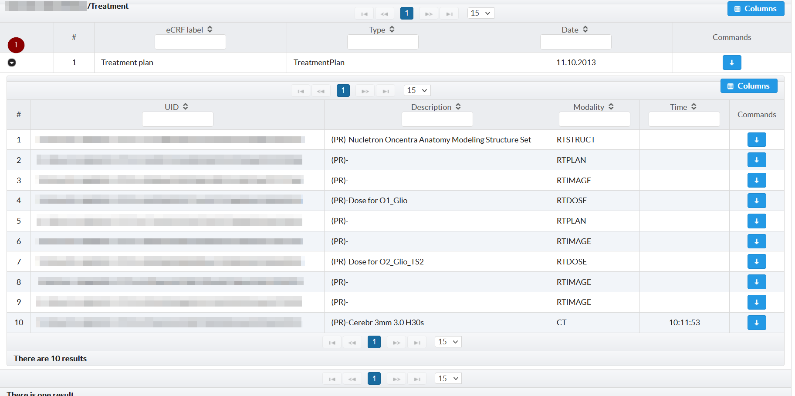

.. [#RPB-Infrastructure] There are different setups depending on the location and the technical possibility to install all components in the specific network.