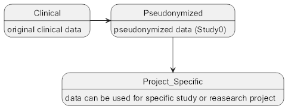

Medical Imaging
===============

.. note::
    The Medical Imaging (PACS) module is available only to users with ROLE_PACS_USER permission. This module operates in
    a scope of user currently selected active study/site. That study need to be configured to collect DICOM data
    (DICOM study tag set to TRUE within the CTMS module).

Concept
-------

This module provides a web user interface to access the research PACS system component configured in RPB platform. It
supports the collection and storage of medical imaging (DICOM) and radiotherapy treatment planning (DICOM-RT) data files.
Currently supported are two different imaging data collection workflows to drive variety of clinical studies:

1. De-identification and upload of DICOM study into **upload slot within specific study event**: this is useful in cases
where study protocol defines imaging to be uploaded at defined time-point (epoch) of study subject within a trial. This
can be e.g. tumour recurrence imaging during scheduled Follow-Up visits or applied radiotherapy treatment plan at
End-Of-Therapy event.

2. Lookup and **collection of DICOM data directly from PACS system**: this is available for sites operating their own
RPB platform instance. It allows to de-identify any clinically archived DICOM study and create project agnostic as well
as project specify copy of the data with highly customisable de-identification rules. Such data does not necessary need
to be associated with specific study event (association with study time-points is completely optional in this case).

DICOM Upload and Regististration on a Study Event
-------------------------------------------------

.. note::
    The ROLE_PACS_USER permission is needed to access this module workflow and upload is available only to users with
    ROLE_PACS_UPLOAD permission.

.. toctree::
   :maxdepth: 1
   :caption: Tasks:

   upload-dicom-client
   upload-dicom-uploader

..
    Display and download uploaded DICOM Studies associated with subject study event
    Schedule event for DICOM Study upload slot

DICOM Lookup and Staging
------------------------

.. note:: ROLE_PACS_LOOKUP permission is needed to access this module workflow and staging (de-identification) is
    available only to users with ROLE_PACS_UPLOAD permission.

.. note:: In order to use DICOM de-identification workflows the site RPB platform instance needs to have internal
    patient registry of patients consented for research purposes. The naming convention for such
    registry in RPB is Study0. It is primarily used for screening purposes and aggregates all patients eligible for
    enrolment into concrete specific research projects. Sometimes we refer to Study0 as project agnostic patient registry.

If RPB is connected to clinical PACS as source of DICOM data, then the lookup module operates with a concept of two
stages/copies of DICOM data. Clinical relevant data in hospital is normally archived in its identifiable form within the
clinical PACS system. This is considered a source data that may be relevant for evaluation in particular research
project. The DICOM lookup in RPB allows to query the clinical PACS utilising patient hospital information system ID or
RPB unique patient pseudonym (this query is limited to patients present int Study0 registry).

1. The first de-identified (project agnostic) copy of DICOM data is created when specific clinical DICOM studies/series are
selected for staging into Study0. Such datasets normally cannot be used for evaluation in concrete research project, but
will serve as base for further project specific de-identification.

2. The second de-identified (project specific) copy of DICOM data is created when specific DICOM studies/series are selected
from research PACS into concrete research project. This dataset is de-identified based on project specific configuration
and is supposed to be used for further analytical processing of research data.

.. toctree::
   :maxdepth: 1
   :caption: Tasks:

   hospital-data-to-study-zero-task
   study-zero-to-study-specific-task

..
    Transfer DICOM data from Study0 to the project specific state
    Associate DICOM data to a specific event
