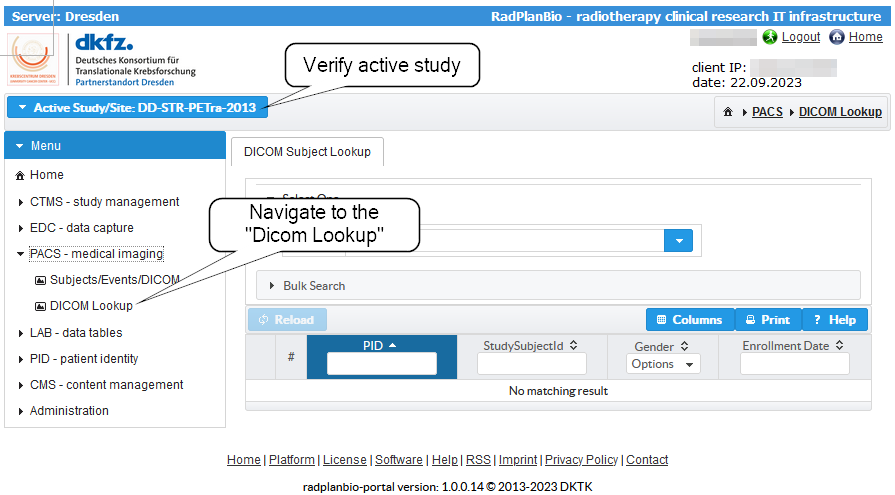
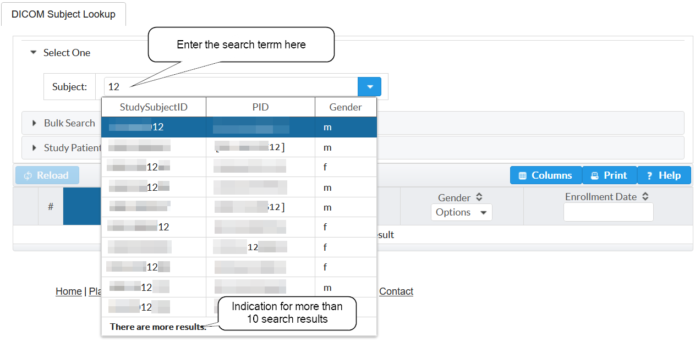
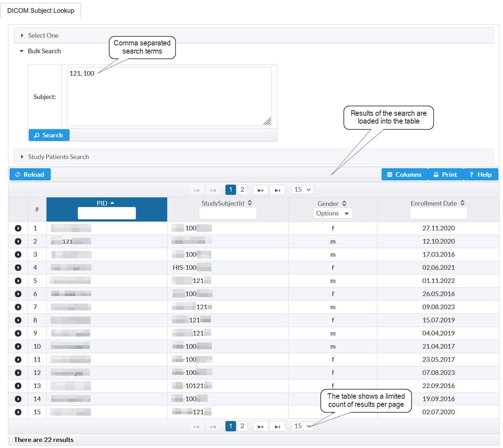
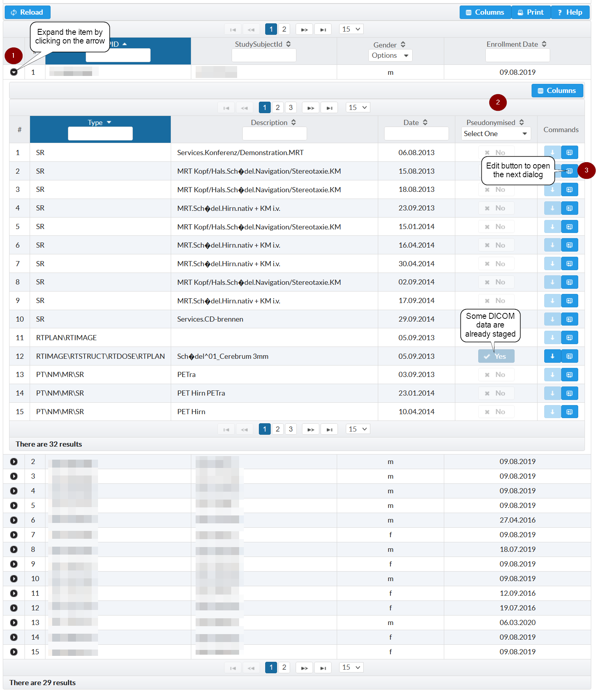
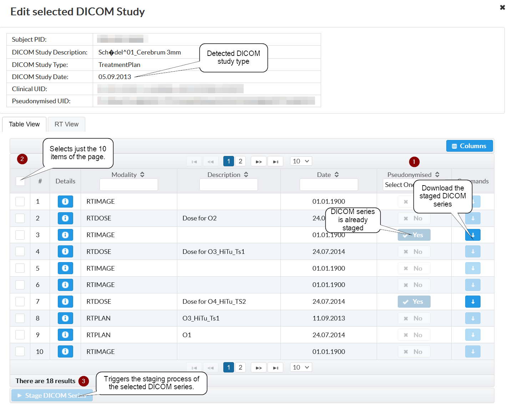
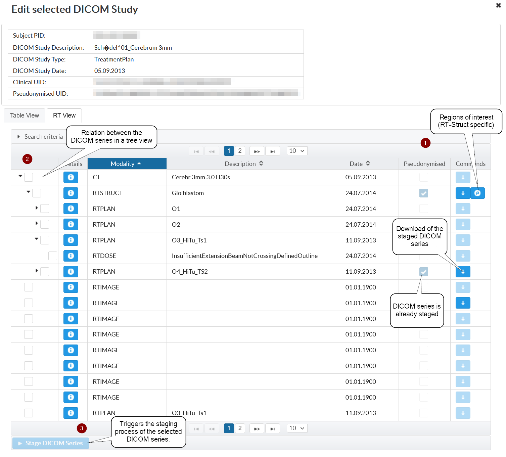
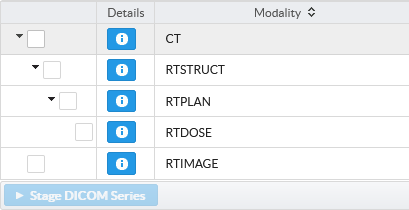
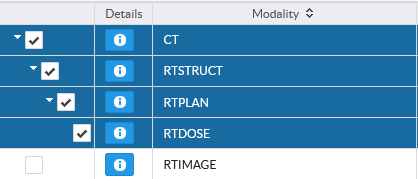
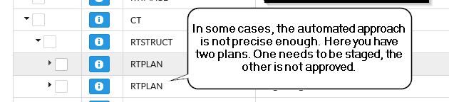

Create Project Specific DICOM
=============================

.. note::
    Users with access to specific project are allowed to create a project agnostic copy of clinical DICOM study.

Task Description
----------------

You want to use DICOM data for a specific research study.

Therefore:

- you need to select the data that are necessary
- trigger the staging step
- review the transfered and pseudonymized data

Prerequisits
------------

- your site is fully integrated in the RPB Infrastructure (otherwise see "Uploadclient")
- all necessary DICOM data are staged in Study0 (otherwise see "Create Project Agnostic DICOM")
- you have access to your study in RadPlanBio

Tasks
-----

1. `Preparation`_
2. `Select the patient`_
3. `Extend the patient table item to see the DICOM studies`_
4. `Navigate to "Edit"`_
5. `Select and stage the DICOM series`_
6. Verify that staging is finished

Preparation
^^^^^^^^^^^

It is important to verify that your specific Study is active to get access to the patients that are enrolled in your study. If you are in a different Study read `here <../overview/overview.rst#change-a-current-active-study>`_ how to change that.

In the menu, navigate to "PACS - medical imaging" -> "DICOM Lookup".

Select the Patient
^^^^^^^^^^^^^^^^^^

There are some options to find the patient.

"Select One" is a combobox that allows to limit the items by entering search terms. It will search for the entered character combinations in the PID or StudySubjectID. The combobox shows up to 10 items. Clicking on an item selects the patient.

"Bulk Search" is intended for the case that you have a comma separated list of identifiers (like: "DummmyId01, DummyId02") that you just paste into the text box. Patients that match will be presented in the table. It would also work with parts of the ids as searchterm, like "yId01,yId02".

Extend the patient table item to see the DICOM studies
^^^^^^^^^^^^^^^^^^^^^^^^^^^^^^^^^^^^^^^^^^^^^^^^^^^^^^

All patients that are selected by the different search options are presented in the main table. The arrow (1) in the first column allows to extend the item. The extended view shows the DICOM data organized as DICOM studies. 
The "pseudonymize" column (2) shows if at least some of the DICOM data is already staged. If there is a "No" then you need definitely to stage DICOM data. A "Yes" just means that there are some DICOM data already staged.

In that case, you could still open the dialog and verify on DICOM series level that all data is staged.

Navigate to "Edit"
^^^^^^^^^^^^^^^^^^

The "Command" column (last column on the right hand side) of the extended table includes an "Edit" |Edit| (3) button. 

.. |Edit| image:: ../img/buttons/edit.png
    :align: bottom
    :width: 24
	

Clicking on that button opens a dialog that allows to select the DICOM series that are of interest for the research project.

Select and stage the DICOM series
^^^^^^^^^^^^^^^^^^^^^^^^^^^^^^^^^

The "Edit selected DICOM Study" facilitates the selection of relevant DICOM series with two different views. The `Table View`_ just presents all DICOM series in paginated table. The `RT View`_ reconstructs the relation between radio therapie specifc DICOM series in a tree. In both cases, it is important to be precise in the selection.

Table View
''''''''''
The table view shows all DICOM series that are available. It is a good choice to select single series or to stage non-radiotherapie DICOM data.

RT View
'''''''
The RT View is build for readiotherapie related DICOM data. Only DICOM series with radiotherapie related modalities are shown there.

It will evaluate the relations between the series and visualize it as a tree. That makes it easier to pick the DICOM data that are of interest.

Selecting the parent will trigger that the children are selected as well.

You still need to check want is relevant. In the next example, two plans are in the clinical system. Just one is approved and needs to be staged.

