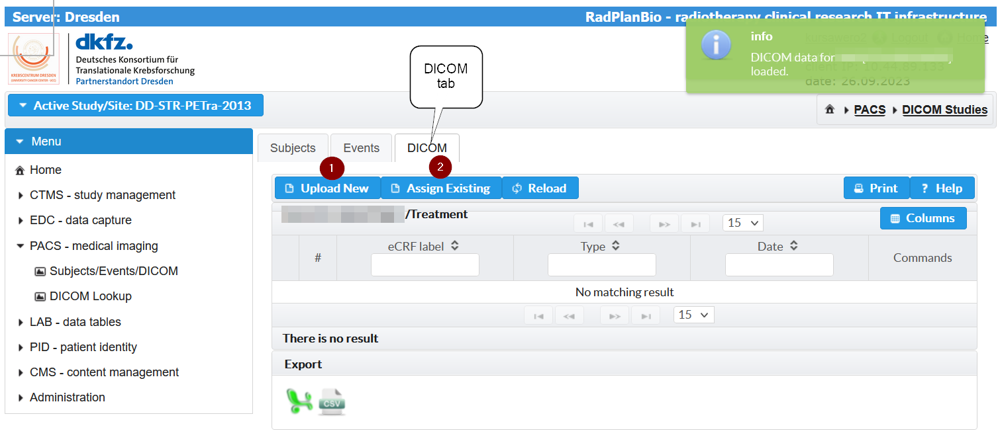
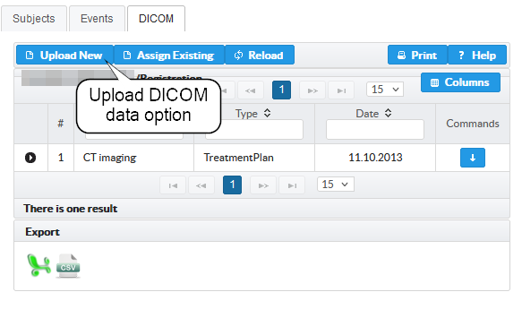
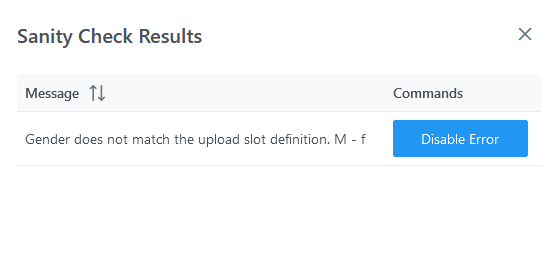

Upload DICOM via Uploader
=========================

- `Task Description`_
- `Prerequisits`_
- `Tasks`_
- `Troubleshooting`_

Task Description
----------------

You want to upload DICOM data via Webbrowser, because your side is not fully integrated into the RPB infrastructure.

Therefore, you need to:

- select the study subject
- select the event
- trigger to start the Uploader in another Browser window
- drop the files/folder with the DICOM data into the "Dropzone" of the Browser
- select the relevant files that are supposed to be submitted
- trigger the upload
- leave the Browser window open until the upload has been finished

Prerequisits
------------

- DICOM data available (files for the Upload Client)
- Subject is enrolled in your study
- Events and upload slots are defined in the EDC system

Tasks
-----

1. `Preparation`_
2. `Select the Subject`_
3. `Select the Event`_
4. `Assign DICOM Data`_
5. `Upload DICOM Data ("Upload New")`_
6. `Upload DICOM Data ("Uploader")`_
7. `Verify Upload Result`_

Preparation
^^^^^^^^^^^
It is important to verify that your Study is active. If you are in a different Study read `here <../overview/overview.rst#change-a-current-active-study>`_ how to change that.

In the menu, navigate to "PACS - medical imaging" -> "Subjects/Events/DICOM".

.. image:: ../img/pacs/DICOM-Upload-to-Study-Event/prepare-upload-to-study-event.png
   :width: 900pt

Select the Subject
^^^^^^^^^^^^^^^^^^

First step is to pick the study subject (patient). A click on the table item loads the events for the subject. The notification in the right upper corner shows that.

.. image:: ../img/pacs/DICOM-Upload-to-Study-Event/select-subject.png
   :width: 900pt

Select the Event
^^^^^^^^^^^^^^^^

Switching to the "Events" tab opens the next view. There you can see available events of the subject. Clicking on the events loads the DICOM data that are already assigned.

.. image:: ../img/pacs/DICOM-Upload-to-Study-Event/select-event.png
   :width: 900pt

Assign DICOM Data
^^^^^^^^^^^^^^^^^

After loading the DICOM data, you can switch to the DICOM tab. There are two options to register DICOM data depending on your location.

Use the option 1 (`Upload DICOM Data ("Upload New")`_).

The table in the tab view would show if there are DICOM studies assigned. We will see that on the end of this section.

Upload DICOM Data ("Uploader")
^^^^^^^^^^^^^^^^^^^^^^^^^^^^^^^^

Clicking on the "Upload New" triggers that an "Upload and Assign DICOM Study" dialog will be opened.

There you can see a list of items that belong to an event and are supposed to reference a DICOM study.

Please choose the item where the DCIOM data belong to and click on the button (1) in the "Commands" column.
There is an additional warning dialog if you are going to overwrite an existing item.

Then, the "Uploader" will be started in the Browser.

Upload DICOM Data ("Upload New")
^^^^^^^^^^^^^^^^^^^^^^^^^^^^^^^^

The UI of the Uploader shows an overview about the upload slot that is supposed to be linked to the DICOM study that will be uploaded.
The folder with the DICOM data can be dropped into the Dropzone of the UI. 
The button bar under the Dropzone gives an overview about the files that are handled, selected and so on.
On the right hand side is always a buttom that will be activated to trigger the next step if possible.
In the first image, the "Connect" button will trigger that the Uploader connects with the Portal to verify the connection and fetches parameters.

The second image shows the state when the Uploader is ready. The "Upload" button is deactivated, because there are no DICOM files prepared for the upload.

Next step is now, to drop the DICOM files into the Dropzone or click on it to open the dialog to select files.
If you clicked - the dialog shown in the next picture will be opened. Here select the folder (1) and then confirm (2) with "Upload".

Ideally, all files in the folder will be parsed and a DICOM study is detected. The next image shows such an example.
In case of problems, the "Ignored" counter is not zero.

If there was a problem with the parsing, you would see an activated "Ignored" button and clicking on the button will open a window.

There you could see the reason. In the example, we just dropped a file with a type that is not suported by the Uploader.

If everything worked fine, you can select the DICOM study. If you drop more than one study, the Uploader would sort out which files belong to which study and present them for selection.
Selecting a study triggers that you can see a table with all DICOM series. The next picture shows the default view.

Clicking on the "Details" button opens a popup with more details about the series.

All DICOM series are listed independent if they have a relation besides residing in the same DICOM study.
In the specific use case of radio therapie related DICOM data the second option view might be usefull.
Clicking on "RT Series" (1) tab opens a tree view just with RT related series that are sorted into the relations from the CT to RTStruct, RTPlan and RTImage/RTDose.
Just expand the tree with clicking on the arrow (2) and you will see the series that reference each other.

The relation will be used to auto select DICOM series that belong to another series that you selected.
In the next example you can see, how it looks like. Just the RTImage was selected by the user (checkmark).
The Uploader automatically selects (minus) the RTPlan, RTStruct and CT that was referenced.

A good idea to pick the correct series, is to check the approval status in RTPlans and RTStructs.

With selecting the DICOM series the "Upload" button gets activated (sanitiy checks could have failed - if not - see `Troubleshooting`_).

.. image:: ../img/pacs/upload-dicom-uploader/activated-upload-button.png
   :width: 600pt

Pushing the button triggers the upload process. 
The dialog shows the count of files that are passing the steps: "Analysed", "Uploaded", and "Verified".

Verify Upload Result
^^^^^^^^^^^^^^^^^^^^
In a last step, the Uploader verifies that all files are uploaded successfully.

The upload was successful if you see the "Finish" button.

Troubleshooting
---------------

Login to the Portal
^^^^^^^^^^^^^^^^^^^

The Uploader needs an active session on the Portal. 
In case that your session expires the Uploader will show a popup windows and ask to login again.
Just click on the link (1). It will open another tab with the Portal login dialog.
Some Browsers might block such activities. In that case, just open another tab and login to the portal.

After the login, switch back to the Uploader tab and click on connect (2).

Sanity Checks Failed
^^^^^^^^^^^^^^^^^^^^

The Uploader analyses if the DICOM data set corresponds to the expected parameters, for instance: that the gender matches.
In case of possible conflicts the "Details" button is colored yellow. 

The popup window will show you the problems in the category "Santity Check".

In addition, the upload button is not active and you see an "Issues" button instead. Clicking on that button will open a dialog that allows to inspect the problem and to disable the warning.

Errors during the Upload
^^^^^^^^^^^^^^^^^^^^^^^^

In case that an error occurs during the upload, there is an error handling within the "Upload Dialog".

In the dialog, you can see the steps that have been passed or not. In the example, just the "Evaluate" step has been passed successfully.
Below that, the current progres is visualized with the file count per step. On the right hand side, there is an option to create a log file or to retry the upload.

A table shows error messages as an overview.

Creating a log file
^^^^^^^^^^^^^^^^^^^
Clicking on the "LogFile" button triggers a dialog that allows to download a detailed log file.

